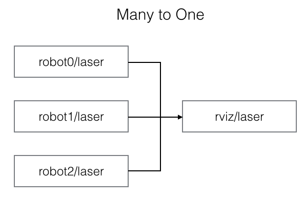
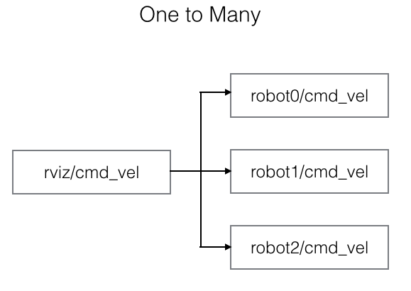

ROS Topic Namespace Multiplexer
=============

Topic-tools [mux](http://wiki.ros.org/topic_tools/mux) allows you to route many incoming topics into one outgoing topic. But this package allows you multiplex both many-to-one connections & one-to-many connections.





This might be useful when you want to control multiple robots using Rviz (see [multi_map_navigation](https://github.com/MohitShridhar/multi_map_navigation)).

## Dependencies & Prerequisites
[ROS Hydro](http://wiki.ros.org/hydro), [Gazebo 3.0+](http://gazebosim.org/), [Catkin](http://wiki.ros.org/catkin): [topic_tools](http://wiki.ros.org/topic_tools), [tf](http://wiki.ros.org/tf) (see [package.xml](package.xml))

## Installation
Clone and catkin_make
```bash
$ git clone https://github.com/MohitShridhar/namespace_mux.git
$ cd <catkin_ws>
$ catkin_make --pkg namespace_mux
```

## Usage

### Namespace Mux

Example:
```xml
<node name="namespace_mux" pkg="namespace_mux" type="namespace_mux" output="screen">

  <rosparam param="/namespace_mux/incoming_ns_prefix">"robot"</rosparam>
  <rosparam param="/namespace_mux/outgoing_ns">"rviz"</rosparam>

  <rosparam param="/namespace_mux/active_bots">[
    "robot0", "robot1"
    ]</rosparam>

  <rosparam param="/namespace_mux/subscribed_topics">[
    "/map_store_map",
    "/odom", 
    "/laser/merged",
    "/laser/scan_back",
    "/laser/scan_front",
    "/move_base/local_costmap/obstacle_layer_footprint/footprint_stamped",
    "/move_base/TrajectoryPlannerROS/local_plan",
    "/move_base/local_costmap/costmap",
    "/move_base/TrajectoryPlannerROS/global_plan",
    "/wormhole_marker",
    "/waiting_area_marker",
    "/particlecloud"
    ]</rosparam>

  <rosparam param="/namespace_mux/published_topics">[
    "/cmd_vel",
    "/initialpose",
    "/move_base_simple/goal",
    "/clicked_point"
    ]</rosparam>

</node>
```
`/namespace_mux/incoming_ns_prefix` is the namespace prefix of the incoming topics. For example: robot0/odom has the prefix "robot". `/namespace_mux/outgoing_ns` is the desired namespace of the outgoing topics (incoming subscriptions or outgoing publications). `/namespace_mux/subscribed_topics` lists the input of **many-to-one** connections. `/namespace_mux/published_topics` lists the input of **one-to-many** connections.

### Fake Map-Frame Publisher
If you multiplex map topics (many to one connection), you will notice that each map has it's own namespaced tf frame-id, eg: 'robot0/map'. This might inconvenience you when you want publish things like goals with map frame-ids based on the currently active map. Use this tool to create a fake tf link between the namespaced frame-ids.
```xml
<node name="fake_tf_broadcaster" pkg="namespace_mux" type="fake_tf_broadcaster" output="screen">
	<rosparam param="/fake_tf_broadcaster/pub_freq">50</rosparam>
	<rosparam param="/fake_tf_broadcaster/input_curr_frame_ids">["robot0/map", "robot1/map"]</rosparam>
	<rosparam param="/fake_tf_broadcaster/output_fake_frame_ids">["rviz/map"]</rosparam>
	<rosparam param="/fake_tf_broadcaster/output_tf_offset">[0.0, 0.0, 0.0, 0.0, 0.0, 0.0]</rosparam>    
</node>
```
Here we create a fake link between `robot0/map` & `robot1/map` with a zero-offset. `/fake_tf_broadcaster/input_curr_frame_ids` contains a list of all the map frame-ids you want link together. `/fake_tf_broadcaster/output_fake_frame_ids` contains the name of the resultant frame-id. *Note:* This will become your 'fixed frame' in Rviz. `/fake_tf_broadcaster/output_tf_offset` is set to zero-origin, if the maps are just indentical copies of each other.
